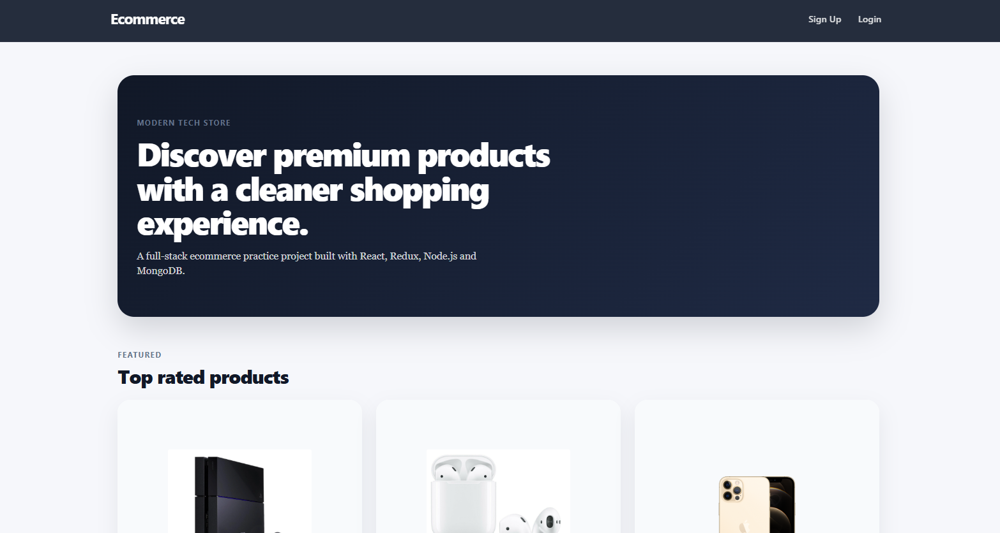
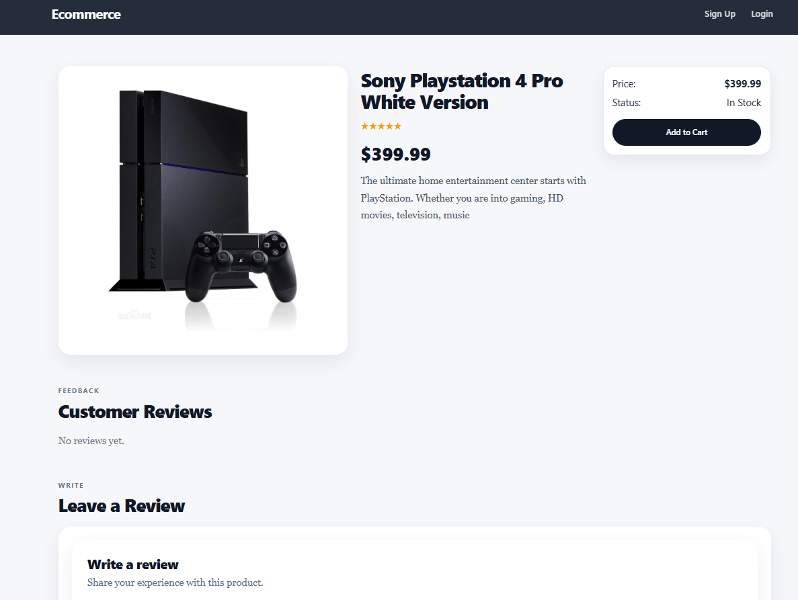
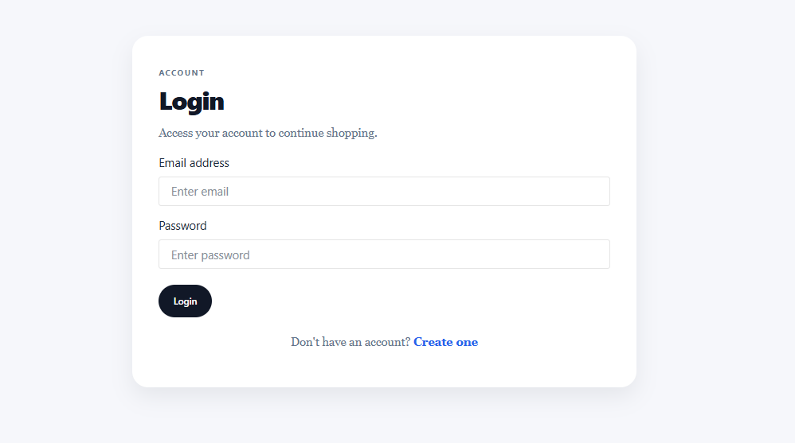
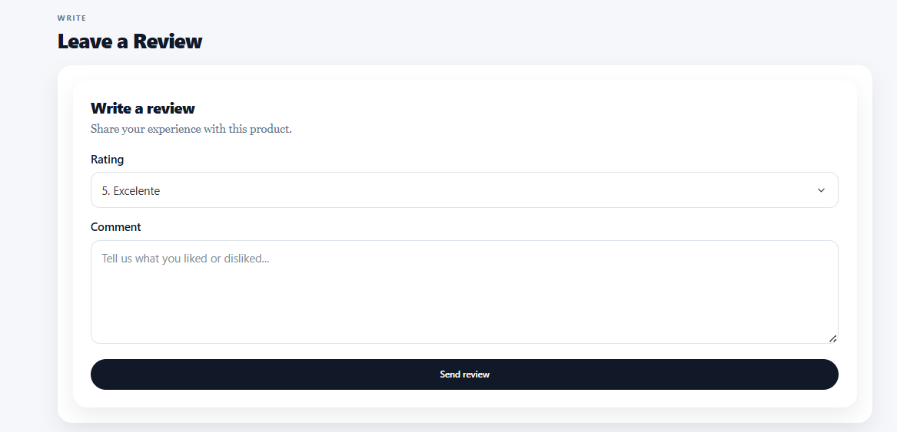

# 🛒 MERN E-commerce Demo

A full-stack e-commerce demo built with the MERN stack, focused on improving UI consistency, user experience and frontend architecture.

This project was refactored from an initial version to create a cleaner, more modern and cohesive interface.

---

## 🚀 Tech Stack

### Frontend
- React
- Redux
- React Bootstrap
- React Router

### Backend
- Node.js
- Express
- MongoDB
- JWT Authentication

---

## ✨ Features

- Product listing
- Product detail page
- Product reviews system
- Clean and modern UI
- Responsive layout
- Redux state management
- API integration (MongoDB)

---

## ⚠️ Notes

This project is presented as a **demo application**.

Some features are intentionally simplified or not fully implemented:

- Authentication (Login / Sign Up) is in demo mode
- Shopping cart is not implemented yet

The goal of this project is to showcase:

- Frontend architecture
- UI refactoring
- Integration with backend services
- Product-oriented thinking

---

## 🎯 Project Goal

The main objective of this project was to:

- Refactor an existing MERN project
- Improve visual design and layout
- Create a more realistic product experience
- Clean up code structure and components

---

## 📸 Screenshots

### Home Page


### Product Page


### Login Page


### Reviews Section


---

## 🛠️ Installation

Clone the repository:

```bash
git clone https://github.com/facucontreras21/mern-ecommerce-demo.git

Backend

cd backend
npm install
npm run dev

Frontend

cd frontend
npm install
npm start

